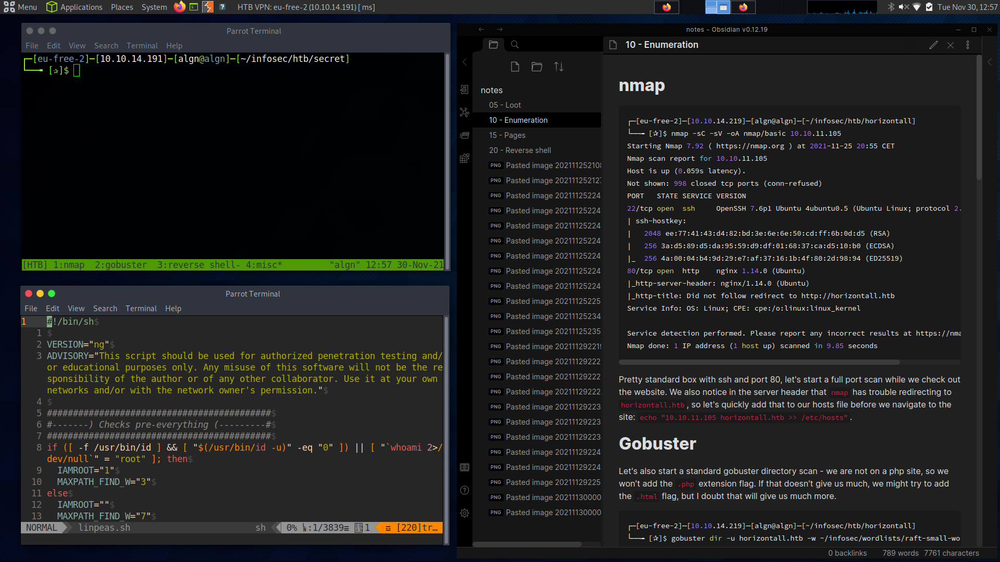
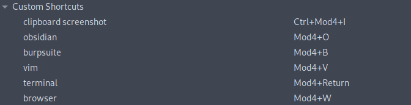
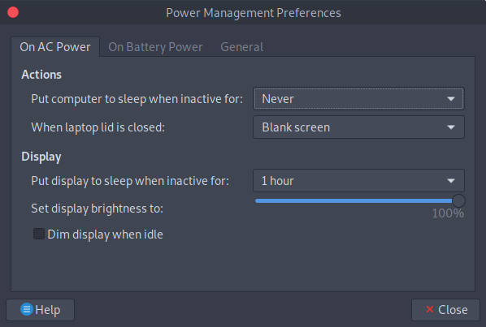
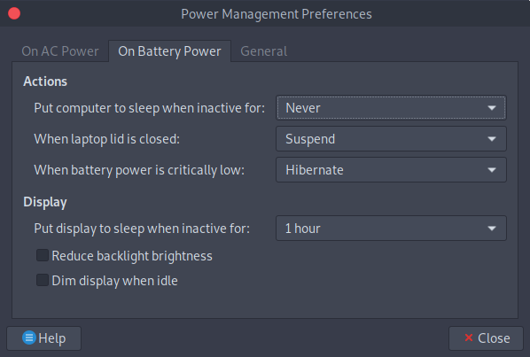
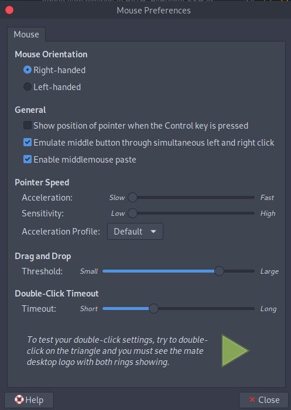

# Parrot Security OS

These are my notes, dotfiles and tweaks/configurations made for the Parrot Security OS to make it emulate my typical workflow from other distros more.

As Parrot is running MATE, quite a bunch of configurations and tweaks have to be made through menus, in such cases I have tried to document how such is done in this README - rest of the tweaks are dotfiles etc. and should be able to be found in this repo.



# pwnbox theme

Follow instructions by `theGuildHall` to emulate the pwnbox theme on your version of Parrot if you want - I would recommend following it at least just for the HTB VPN tweaks: https://github.com/theGuildHall/pwnbox

# VIM

Install `vim-plug`: https://github.com/junegunn/vim-plug and the most of the config file is taken from my dotfiles repository: https://github.com/4lgn/dotfiles/blob/bspwm/.vimrc

As the default is `nvim`, remember to install the config file under `~/.config/nvim/init.vim`, this config file is also found in this repo.

# tmux

Config file found in `./tmux.conf`

# Note-taking

I use [Obsidian](https://obsidian.md/) for note-taking, you can use `snap` to install it quickly

## Screenshotting

To easily and quickly screengrab a portion of my screen, I use `maim` and a keyboard shortcut to perform the script to pipe it into the clipboard:

```bash
maim -s | xclip -selection clipboard -t image/png
```

# Keyboard stuff

## Shortcuts

Open application `Keyboard Shortcuts` and set the following

### Workspaces

"Switch to workspace x": "Mod4+x"

"Move window to workspace x": "Shift+Mod4+x"

### Custom



### Misc.

"Close window": "Shift+Mod4+Q"

"Maximize window": "Mod4+F"

"Restore window": "Mod4+Down"

## Map Caps -> ESC

`Keyboard` -> Layouts -> remember to have a "Keyboard model" selected -> Options -> Caps Lock behavior -> Make Caps Lock an additional Esc

# Misc. MATE tweaks

## Power management

This is mainly regarding not dimming backlight brightness when on battery - I can control the screen brightness myself, thanks.





## Remove desktop icons

`MATE Tweak` -> Desktop -> untick everything you don't want shown

## Mouse settings



# VNC

I use tigervnc, and the vnc config file to startup a MATE session is found in `~/.vnc/xstartup`

Make sure `tigervnc` is installed:

```bash
sudo apt install tigervnc-standalone-server tigervnc-xorg-extension
```

Start the server

```bash
vncserver -localhost no
```

On the viewing desktop, I usually just use the RealVNC Viewer as it captures the keyboard, allowing me to use all my shortcuts etc.
